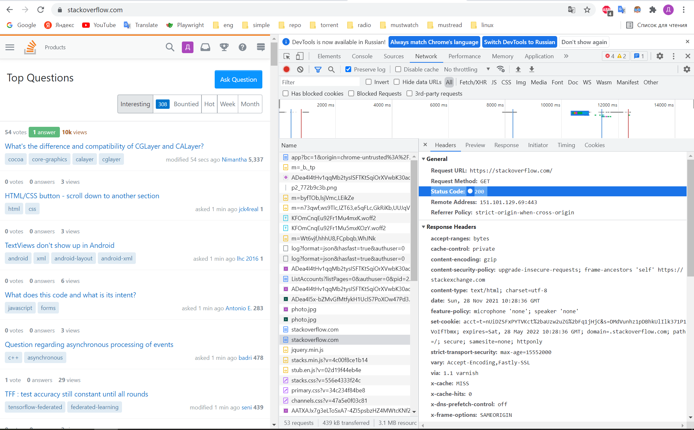

# Домашнее задание к занятию "3.6. Компьютерные сети, лекция 1"

1. Работа c HTTP через телнет.
- Подключитесь утилитой телнет к сайту stackoverflow.com
`telnet stackoverflow.com 80`
- отправьте HTTP запрос
```bash
GET /questions HTTP/1.0
HOST: stackoverflow.com
[press enter]
[press enter]
```
- В ответе укажите полученный HTTP код, что он означает?

```shell script
HTTP/1.1 301 Moved Permanently
cache-control: no-cache, no-store, must-revalidate
location: https://stackoverflow.com/questions
x-request-guid: 962c16b9-88c9-49ba-9cf1-42466f55fe27
feature-policy: microphone 'none'; speaker 'none'
content-security-policy: upgrade-insecure-requests; frame-ancestors 'self' https://stackexchange.com
Accept-Ranges: bytes
Date: Sun, 28 Nov 2021 10:26:14 GMT
Via: 1.1 varnish
Connection: close
X-Served-By: cache-hhn4021-HHN
X-Cache: MISS
X-Cache-Hits: 0
X-Timer: S1638095174.921518,VS0,VE183
Vary: Fastly-SSL
X-DNS-Prefetch-Control: off
Set-Cookie: prov=302049f9-f126-9189-fbd2-e90dff09e3b7; domain=.stackoverflow.com; expires=Fri, 01-Jan-2055 00:00:00 GMT; path=/; HttpOnly

Connection closed by foreign host.
```

код 301, страница переехала по адресу `https://stackoverflow.com/questions`

2. Повторите задание 1 в браузере, используя консоль разработчика F12.
- откройте вкладку `Network`
- отправьте запрос http://stackoverflow.com
- найдите первый ответ HTTP сервера, откройте вкладку `Headers`
- укажите в ответе полученный HTTP код.
- проверьте время загрузки страницы, какой запрос обрабатывался дольше всего?
- приложите скриншот консоли браузера в ответ.

```shell script
Status Code: 200 
```



3. Какой IP адрес у вас в интернете?

```shell script
// source 2ip.ru
195.184.214.104
```

4. Какому провайдеру принадлежит ваш IP адрес? Какой автономной системе AS? Воспользуйтесь утилитой `whois`

```shell script
% Information related to '195.184.214.0/24AS3261'

route:          195.184.214.0/24
descr:          LLC FTICOM
descr:          Donetsk, Ukraine
origin:         AS3261
mnt-by:         AS3261-MNT
created:        1970-01-01T00:00:00Z
last-modified:  2009-10-19T17:34:29Z
source:         RIPE # Filtered
```
5. Через какие сети проходит пакет, отправленный с вашего компьютера на адрес 8.8.8.8? Через какие AS? Воспользуйтесь утилитой `traceroute`

```shell script
ytil@DESKTOP-1283MUP:/mnt/c/Users/ivann$ traceroute -An 8.8.8.8
traceroute to 8.8.8.8 (8.8.8.8), 30 hops max, 60 byte packets
 1  172.31.144.1 [*]  0.457 ms  0.432 ms  0.630 ms
 2  192.168.88.1 [*]  5.620 ms  5.614 ms  5.592 ms
 3  * * *
 4  * * *
 5  * * *
 6  * * *
 7  * * *
 8  * * *
 9  * * *
10  * * *
11  * * *
12  * * *
13  * * *
14  * * *
15  * * *
16  * * *
17  * * *
18  * * *
19  * * *
20  * * *
21  * * *
22  * * *
```

не знаю как посмотреть

6. Повторите задание 5 в утилите `mtr`. На каком участке наибольшая задержка - delay?

не могу посмотреть, так как ICMP дальше роутера не возвращается

7. Какие DNS сервера отвечают за доменное имя dns.google? Какие A записи? воспользуйтесь утилитой `dig`

```shell script
root@vagrant:/home/vagrant# dig +short dns.google NS
ns3.zdns.google.
ns4.zdns.google.
ns2.zdns.google.
ns1.zdns.google.

root@vagrant:/home/vagrant# dig +short dns.google A
8.8.8.8
8.8.4.4
```

8. Проверьте PTR записи для IP адресов из задания 7. Какое доменное имя привязано к IP? воспользуйтесь утилитой `dig`

```shell script
dig -x 8.8.8.8
;; ANSWER SECTION:
8.8.8.8.in-addr.arpa.   6999    IN      PTR     dns.google.

dig -x 8.8.4.4
;; ANSWER SECTION:
8.8.4.4..in-addr.arpa.   6999    IN      PTR     dns.google.
```

В качестве ответов на вопросы можно приложите лог выполнения команд в консоли или скриншот полученных результатов.
