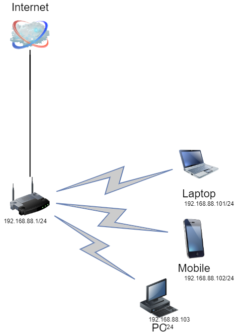

# Домашнее задание к занятию "3.8. Компьютерные сети, лекция 3"

1. Подключитесь к публичному маршрутизатору в интернет. Найдите маршрут к вашему публичному IP
```
telnet route-views.routeviews.org
Username: rviews
show ip route x.x.x.x/32
show bgp x.x.x.x/32
```

```shell
route-views>show ip route 195.184.214.88
Routing entry for 195.184.214.0/24
  Known via "bgp 6447", distance 20, metric 0
  Tag 6939, type external
  Last update from 64.71.137.241 14:36:59 ago
  Routing Descriptor Blocks:
  * 64.71.137.241, from 64.71.137.241, 14:36:59 ago
      Route metric is 0, traffic share count is 1
      AS Hops 6
      Route tag 6939
      MPLS label: none
route-views>show bgp 195.184.214.88
BGP routing table entry for 195.184.214.0/24, version 3891523420
Paths: (22 available, best #22, table default)
  Not advertised to any peer
  Refresh Epoch 3
  3303 12389 48276 41039 41039 41039 41039
    217.192.89.50 from 217.192.89.50 (138.187.128.158)
      Origin IGP, localpref 100, valid, external
      Community: 3303:1004 3303:1006 3303:1030 3303:3056
      path 7FE0F8167D08 RPKI State valid
      rx pathid: 0, tx pathid: 0
      ...
```
2. Создайте dummy0 интерфейс в Ubuntu. Добавьте несколько статических маршрутов. Проверьте таблицу маршрутизации.

```shell
vagrant@vagrant:~$ ip a
1: lo: <LOOPBACK,UP,LOWER_UP> mtu 65536 qdisc noqueue state UNKNOWN group default qlen 1000
    link/loopback 00:00:00:00:00:00 brd 00:00:00:00:00:00
    inet 127.0.0.1/8 scope host lo
       valid_lft forever preferred_lft forever
    inet6 ::1/128 scope host
       valid_lft forever preferred_lft forever
2: eth0: <BROADCAST,MULTICAST,UP,LOWER_UP> mtu 1500 qdisc fq_codel state UP group default qlen 1000
    link/ether 08:00:27:73:60:cf brd ff:ff:ff:ff:ff:ff
    inet 10.0.2.15/24 brd 10.0.2.255 scope global dynamic eth0
       valid_lft 81172sec preferred_lft 81172sec
    inet6 fe80::a00:27ff:fe73:60cf/64 scope link
       valid_lft forever preferred_lft forever
3: dummy0: <BROADCAST,NOARP,UP,LOWER_UP> mtu 1500 qdisc noqueue state UNKNOWN group default qlen 1000
    link/ether fe:20:1b:ec:ea:4f brd ff:ff:ff:ff:ff:ff
    inet 192.168.168.1/32 scope global dummy0
       valid_lft forever preferred_lft forever
    inet6 fe80::fc20:1bff:feec:ea4f/64 scope link
       valid_lft forever preferred_lft forever

vagrant@vagrant:~$ ip r
default via 10.0.2.2 dev eth0 proto dhcp src 10.0.2.15 metric 100
10.0.2.0/24 dev eth0 proto kernel scope link src 10.0.2.15
10.0.2.2 dev eth0 proto dhcp scope link src 10.0.2.15 metric 100

vagrant@vagrant:~$ dig +short ya.ru
87.250.250.242

vagrant@vagrant:~$ sudo ip r add 87.250.250.0/24 via 10.0.2.2
vagrant@vagrant:~$ ping ya.ru -c 1
PING ya.ru (87.250.250.242) 56(84) bytes of data.
64 bytes from ya.ru (87.250.250.242): icmp_seq=1 ttl=246 time=24.4 ms

--- ya.ru ping statistics ---
1 packets transmitted, 1 received, 0% packet loss, time 0ms
rtt min/avg/max/mdev = 24.361/24.361/24.361/0.000 ms

vagrant@vagrant:~$ ip r
default via 10.0.2.2 dev eth0 proto dhcp src 10.0.2.15 metric 100
10.0.2.0/24 dev eth0 proto kernel scope link src 10.0.2.15
10.0.2.2 dev eth0 proto dhcp scope link src 10.0.2.15 metric 100
87.250.250.0/24 via 10.0.2.2 dev eth0

```
3. Проверьте открытые TCP порты в Ubuntu, какие протоколы и приложения используют эти порты? Приведите несколько примеров.

```shell
vagrant@vagrant:~$ ss -lt
State           Recv-Q          Send-Q                   Local Address:Port                     Peer Address:Port          Process
LISTEN          0               4096                     127.0.0.53%lo:domain                        0.0.0.0:*
LISTEN          0               128                            0.0.0.0:ssh                           0.0.0.0:*
LISTEN          0               4096                           0.0.0.0:sunrpc                        0.0.0.0:*
LISTEN          0               128                               [::]:ssh                              [::]:*
LISTEN          0               4096                              [::]:sunrpc                           [::]:*
```

слушаются domain(dns):53, ssh:22

4. Проверьте используемые UDP сокеты в Ubuntu, какие протоколы и приложения используют эти порты?

```shell
vagrant@vagrant:~$ ss -lu
State           Recv-Q          Send-Q                    Local Address:Port                     Peer Address:Port         Process
UNCONN          0               0                         127.0.0.53%lo:domain                        0.0.0.0:*
UNCONN          0               0                        10.0.2.15%eth0:bootpc                        0.0.0.0:*
UNCONN          0               0                               0.0.0.0:sunrpc                        0.0.0.0:*
UNCONN          0               0                                  [::]:sunrpc                           [::]:*
```

```shell
vagrant@vagrant:~$ ss -lu src :68
State           Recv-Q          Send-Q                    Local Address:Port                     Peer Address:Port         Process
UNCONN          0               0                        10.0.2.15%eth0:bootpc                        0.0.0.0:*
```

например DHCP клиент на 68 порту

5. Используя diagrams.net, создайте L3 диаграмму вашей домашней сети или любой другой сети, с которой вы работали.
   
 ---
## Задание для самостоятельной отработки (необязательно к выполнению)

6*. Установите Nginx, настройте в режиме балансировщика TCP или UDP.

7*. Установите bird2, настройте динамический протокол маршрутизации RIP.

8*. Установите Netbox, создайте несколько IP префиксов, используя curl проверьте работу API.

 ---
