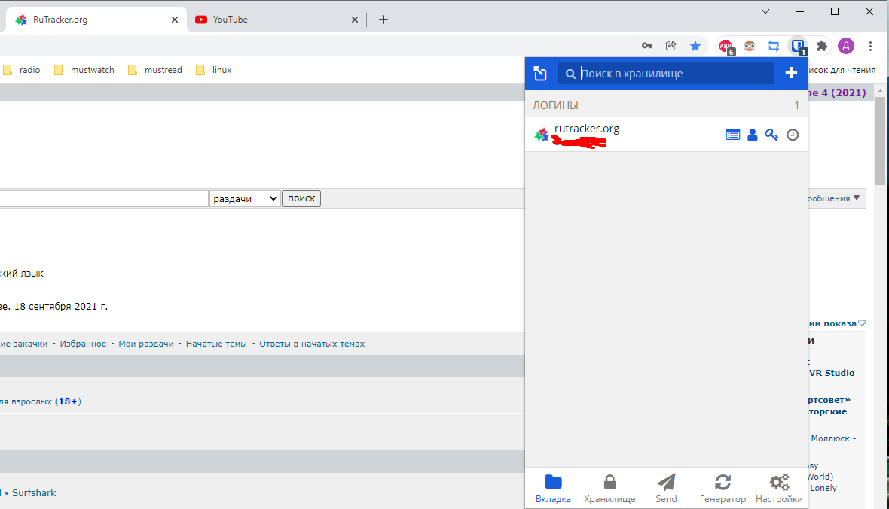
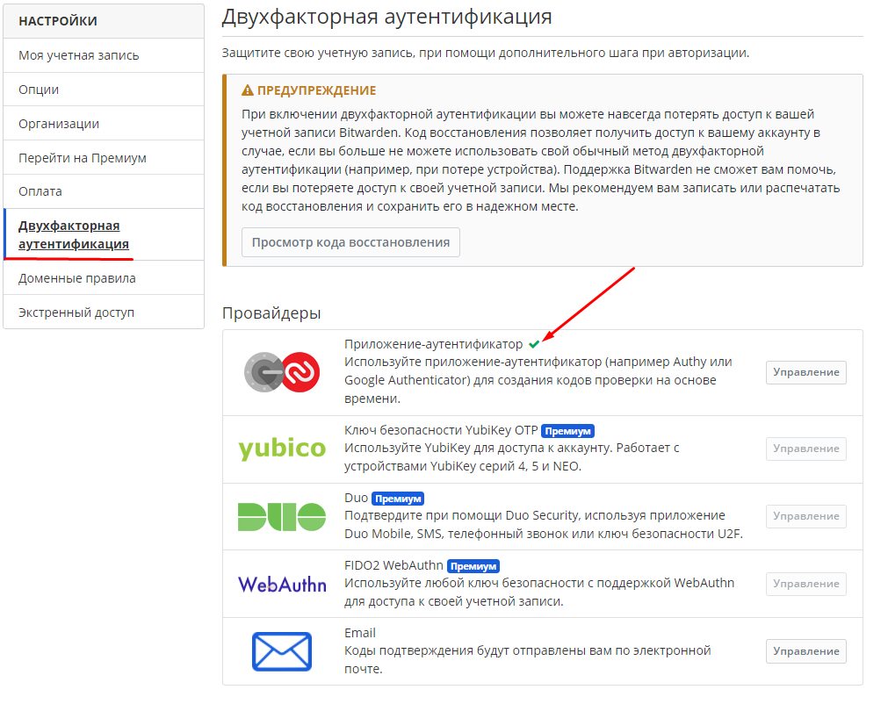
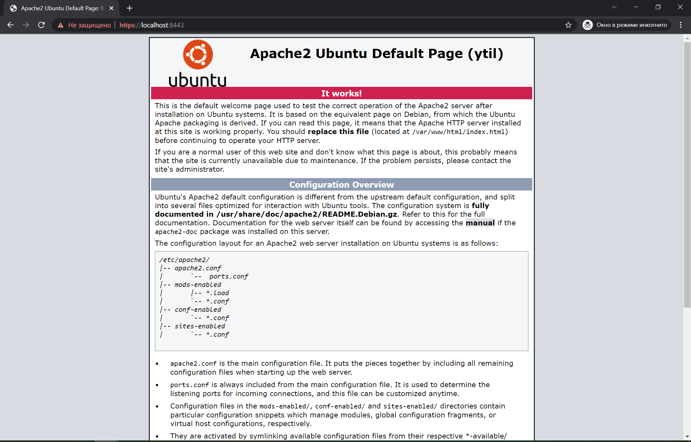

# Домашнее задание к занятию "3.9. Элементы безопасности информационных систем"

1. Установите Bitwarden плагин для браузера. Зарегестрируйтесь и сохраните несколько паролей.
   
2. Установите Google authenticator на мобильный телефон. Настройте вход в Bitwarden акаунт через Google authenticator
   OTP.
   
3. Установите apache2, сгенерируйте самоподписанный сертификат, настройте тестовый сайт для работы по HTTPS.
   
4. Проверьте на TLS уязвимости произвольный сайт в интернете (кроме сайтов МВД, ФСБ, МинОбр, НацБанк, РосКосмос,
   РосАтом, РосНАНО и любых госкомпаний, объектов КИИ, ВПК ... и тому подобное).

   ```shell
   vagrant@vagrant:~/testssl.sh$ ./testssl.sh -U --sneaky https://example.com/
   
   ###########################################################
       testssl.sh       3.1dev from https://testssl.sh/dev/
       (06890d4 2022-01-10 11:19:10 -- )
   
         This program is free software. Distribution and
                modification under GPLv2 permitted.
         USAGE w/o ANY WARRANTY. USE IT AT YOUR OWN RISK!
   
          Please file bugs @ https://testssl.sh/bugs/
   
   ###########################################################
   
   Using "OpenSSL 1.0.2-chacha (1.0.2k-dev)" [~183 ciphers]
   on vagrant:./bin/openssl.Linux.x86_64
   (built: "Jan 18 17:12:17 2019", platform: "linux-x86_64")
   
   
   Start 2022-01-22 08:19:46        -->> 93.184.216.34:443 (example.com) <<--
   
   Further IP addresses:   2606:2800:220:1:248:1893:25c8:1946
   rDNS (93.184.216.34):   --
   Service detected:       HTTP
   
   
   Testing vulnerabilities
   
   Heartbleed (CVE-2014-0160)                not vulnerable (OK), no heartbeat extension
   CCS (CVE-2014-0224)                       not vulnerable (OK)
   Ticketbleed (CVE-2016-9244), experiment.  not vulnerable (OK)
   ```

5. Установите на Ubuntu ssh сервер, сгенерируйте новый приватный ключ. Скопируйте свой публичный ключ на другой сервер.
   Подключитесь к серверу по SSH-ключу.

   ```shell
   # on ubuntu 2
   vagrant@vagrant:~$ ssh-keygen -f ~/ssh_keys
   vagrant@vagrant:~$ ssh-copy-id -i ~/ssh_keys.pub vagrant@192.168.100.101
   /usr/bin/ssh-copy-id: INFO: Source of key(s) to be installed: "/home/vagrant/ssh_keys.pub"
   /usr/bin/ssh-copy-id: INFO: attempting to log in with the new key(s), to filter out any that are already installed
   /usr/bin/ssh-copy-id: INFO: 1 key(s) remain to be installed -- if you are prompted now it is to install the new keys
   vagrant@192.168.100.101's password:
   
   Number of key(s) added: 1
   
   Now try logging into the machine, with:   "ssh 'vagrant@192.168.100.101'"
   and check to make sure that only the key(s) you wanted were added.
   
   vagrant@vagrant:~$ ssh -i ~/ssh_keys vagrant@192.168.100.101
   Welcome to Ubuntu 20.04.2 LTS (GNU/Linux 5.4.0-80-generic x86_64)
   ```

6. Переименуйте файлы ключей из задания 5. Настройте файл конфигурации SSH клиента, так чтобы вход на удаленный сервер
   осуществлялся по имени сервера.

   ```shell
   vagrant@vagrant:~$ mv ~/ssh_keys ~/ssh_renamed_keys
   vagrant@vagrant:~$ mv ~/ssh_keys.pub ~/ssh_renamed_keys.pub

   vagrant@vagrant:~/.ssh$ cat config
   Host ubuntu1
   HostName 192.168.100.101
   IdentityFile ~/ssh_renamed_keys
   User vagrant

   vagrant@vagrant:~/.ssh$ ssh ubuntu1
   Welcome to Ubuntu 20.04.2 LTS (GNU/Linux 5.4.0-80-generic x86_64)
   ```

7. Соберите дамп трафика утилитой tcpdump в формате pcap, 100 пакетов. Откройте файл pcap в Wireshark.

   ```shell
   root@vagrant:/home/vagrant/.ssh# tcpdump -w /home/vagrant/0001.pcap -c 100
   ```

   

 ---

## Задание для самостоятельной отработки (необязательно к выполнению)

8*. Просканируйте хост scanme.nmap.org. Какие сервисы запущены?

9*. Установите и настройте фаервол ufw на web-сервер из задания 3. Откройте доступ снаружи только к портам 22,80,443

